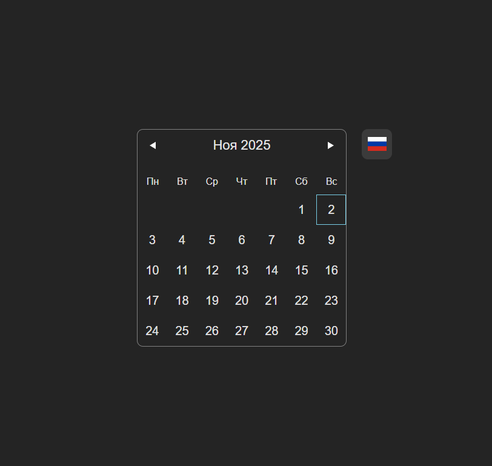

## Превью


### Запуск проекта

```
npm i - установка зависимостей
npm start - запуск
```

---

### Запуск линтеров

- `npm run eslint:fix`
- `npm run prettier:fix`

или

- `npm run lint:fix-all` - запуск сразу всех трех